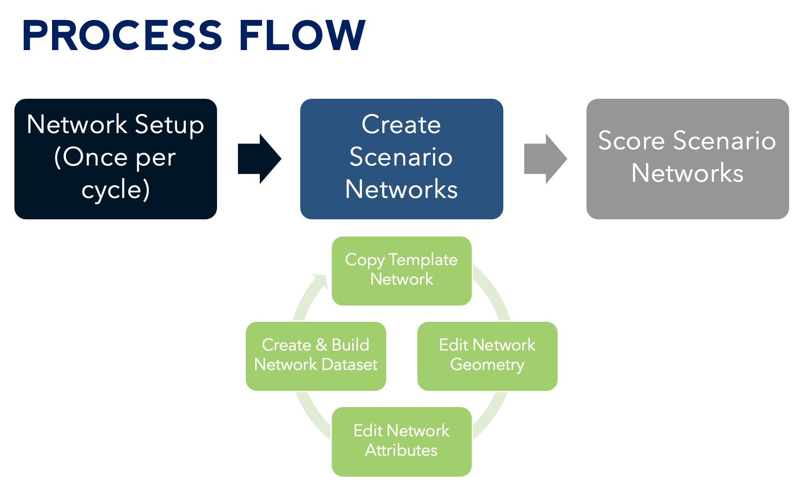

# ATO Impacts Tool

A Network Analyst based tool for assessing changes in Access to Opportunity (ATO) resulting from regional mobility investments.

### Tool Authors

* [Mark Egge](mailto:egge@highstreetconsulting.com) - High Street
* Anna Batista - High Street
* Bert Granberg - WFRC
* Julie Bjornstad - WFRC
* Josh Reynolds - WFRC

## Motivation

A tool for calculating access to opportunity (ATO) as defined and implemented by WFRC: the number of jobs and households "accessible" to a given traffic analysis zone (TAZ) where nearer jobs and households count more than jobs and households further away. Learn more about [Access to Opportunities](https://wfrc.org/maps-data/access-to-opportunities/)

ATO can be calculated for the road and transit networks by estimating travel times (via car or transit) between TAZs and then weighting the number of nearby jobs and households by a travel-time decay curve. The result is an estimate for each TAZ of the number of jobs and households "accessible" from a given TAZ. Individual TAZ access can be summed across the region for an estimated measure of access. The impacts of projects that improve mobility (and thereby accessibility) are estimated by assigning estimated reductions in travel times along calculated routes and tabulating the increase in the number of jobs and households accessible within given travel times.

## Requirements

The tool is implemented through Esri ArcGIS Pro Network Analyst using Python and Jupyter Notebooks.

* ArcGIS Pro (Advanced)
* Network Analyst Extension
* Familiarity with Python and Jupyter notebooks

## Scoring Projects

1) Run `1_network_setup.ipynb` and `2_taz_setup.ipynb` once. This sets everything up, including baseline scores and the template network dataset that will be modified for the scenarios. 
2) For each project, step through the appropriate 3_*.ipynb notebook corresponding to the appropriate mode. I find this take 5 – 15 minutes per project, depending on the complexity of the project.
3) Then, run [4_score.ipynb]. This notebook walks through all of the modified scenario networks in the scenario folder and scores each, writing the output results to tables within the file geodatabase. The “scores_summary” table contains the TAZ-level results. If a file geodatabase already contains a “scores” table it is skipped. Then, the script summarizes the ATO improvement scores for all scored scenarios. 

An analyst or planner could quickly create scenario networks for a bunch of projects and then let the scoring notebook run overnight.

Scores for each scenario represent the weighted average TAZ-level change in access for each category:

* Average TAZ-level increased access to jobs, weighted by households within the TAZ
* Average TAZ-level increased access to households, weighted by jobs within the TAZ
* Average TAZ-level increased ATO (using WFRC’s ATO formula), weighted by jobs and households within the TAZ)
* Average TAZ-level increased access to jobs, weighted by households within the TAZ, for Poverty Equity Focus Area TAZs
* Average TAZ-level increased access to jobs, weighted by households within the TAZ, for Minority Equity Focus Area TAZs
* Average TAZ-level increased access to jobs, weighted by households within the TAZ, for Zero Car Household Equity Focus Area TAZs
* Average TAZ-level increased access to jobs, weighted by households within the TAZ, for All Equity Focus Area TAZs

Scores for each scenario are stored into an export CSV: `scenario\scenario_scores.csv` for transportation projects and `scenario\land_use_scenario_scores.csv` for land use projects. 

# Operating the Tool

Baseline Setup will be completed once per year. 

Once the baseline setup is complete, one scenario will be created for each candidate project. Scenarios can be built out quickly—each scenario should only take a few minutes to build out. 

Finally, the scoring notebook scores the defined scenarios. Scoring takes 5 – 20 minutes per scenario. All unscored scenarios will automatically be scored when the scoring note book runs. A suggested workflow would be to define a set of new scenarios, and then let the scoring notebook run over the lunch hour or overnight!

## Baseline Setup

### Network Setup - 1_network_setup.ipynb

To set up the multimodal transportation network, 
1. Download Multimodal network dataset from https://gis.utah.gov/data/transportation/street-network-analysis/ and extract to the `shp` folder.
3. Obtain a copy of a TDM export from WFRC and place in the `shp` folder

Run 1_network_setup.ipynb (requires Network Analyst)

### TAZ Setup - 2_taz_setup.ipynb

1. Download [Wasatch Front TAZs in File Geodatabase format from WFRC](https://data.wfrc.org/datasets/wfrc::access-to-opportunities-work-related-taz-based/about). Extract to `taz.gdb` and place in the `shp` folder

Run `2_taz_setup.ipynb` (requires ArcGIS Pro Standard or Advanced). This will calcualte the baseline ATO.

## Scenario Setup

For each project type, choose the appropriate notebook and follow the embedded instructions. Supported project types:

### Roadway Projects - 3_mod_drive.ipynb

* New Connection
* Capacity Expansion
* Operational
* New Interchange
* Grade-Separated Crossing

### Transit Projects - 3_mod_transit.ipynb

* New Route
* Service Improvement

### Cycling Projects (Work in Progress) - 3_mod_cycling.ipynb

* Shared Use Path
* Protected Bike Lane
* Buffered Bike Lane
* Bike Boulevard
* Bike Lane

### Land Use Projects - 3_mod_land_use.ipynb

* Absolute Change in Number of Jobs
* Absolute Change in Number of Households
* Percent Change in Jobs
* Percent Change in Households

## Scoring

Finally, run `4_score.ipynb` to generate the scenario scores.

### Troubleshooting

- If encountering error: no travelMode in network dataset, the network_temple.xml needs to be recreated

- There is an error in Esri's Network Analyst suite that occassionally causes field values in a network dataset to get transposed between fields, resulting in nonsensical impedance values (refer to Esri Case #02899742). This project includes an embedded diagnostic to detect invalid networks.

- The `test` function tests for a correct network build by solving a simple routing problem between two points defined in `shp\test_points\test_points.shp`. If these points are not located within the service area of the network dataset, the test will fail.

- In general, if the network dataset fails, the cure is simply to rebuild the network dataset using `ato.build(nd)`.
